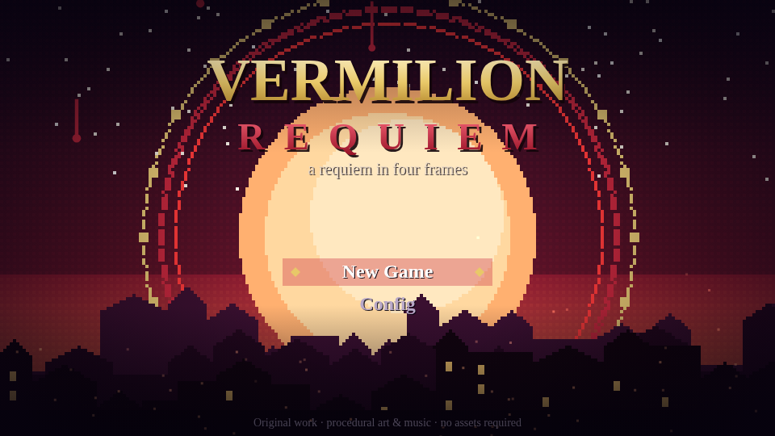
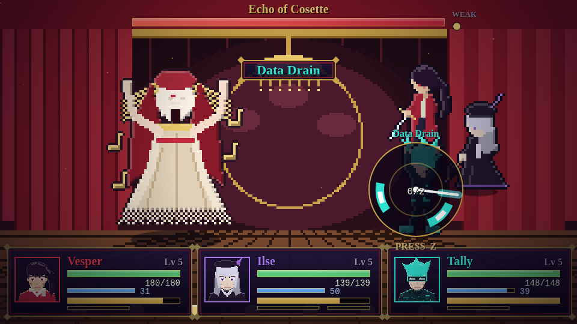
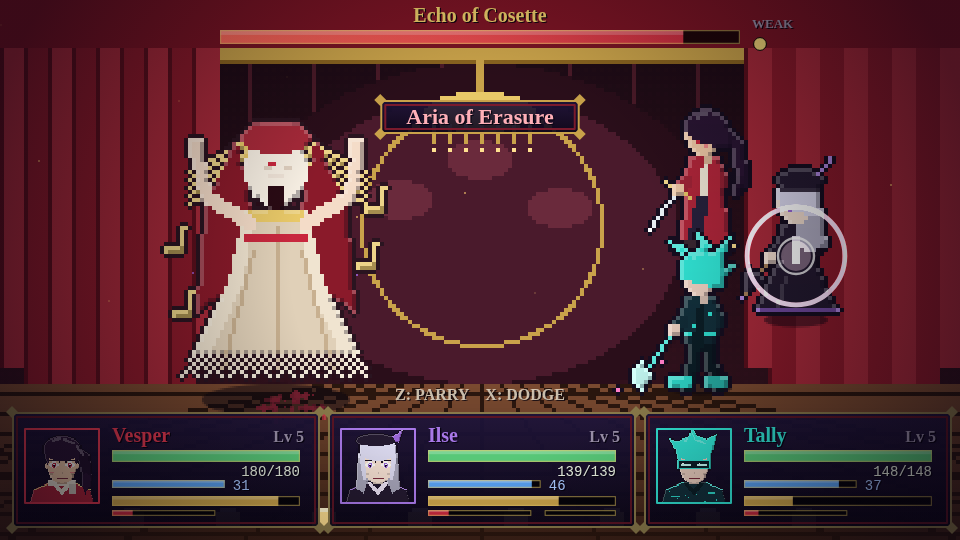
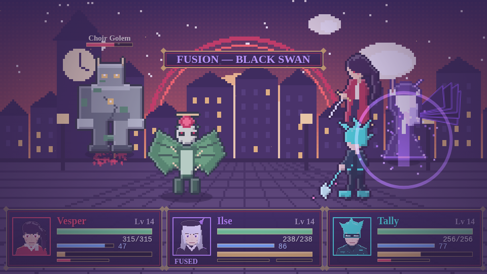
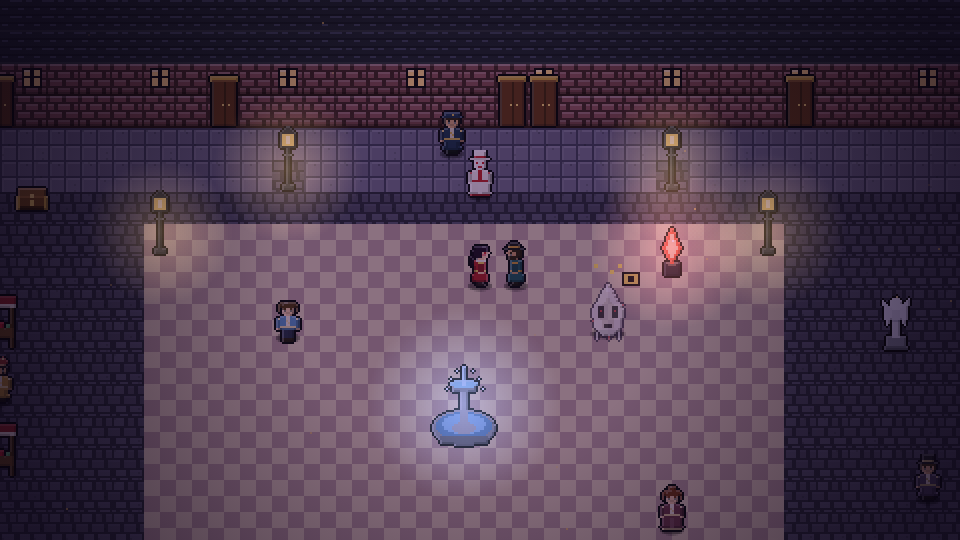
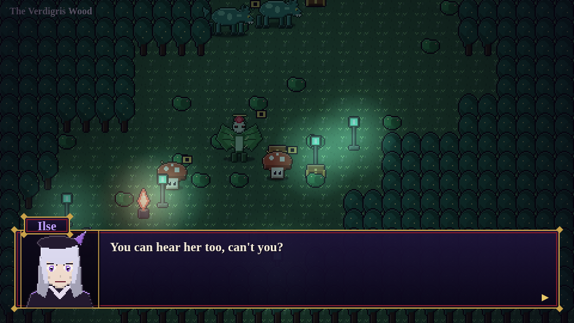
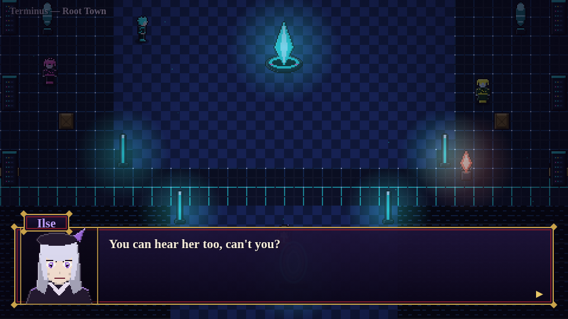
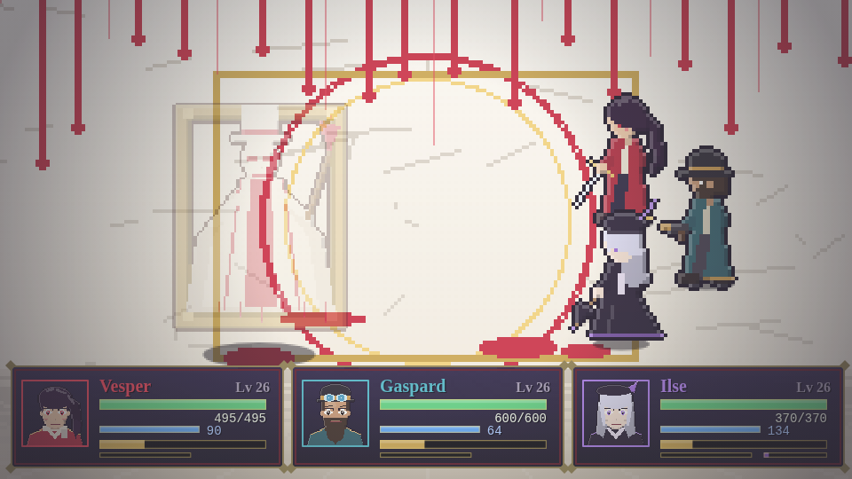
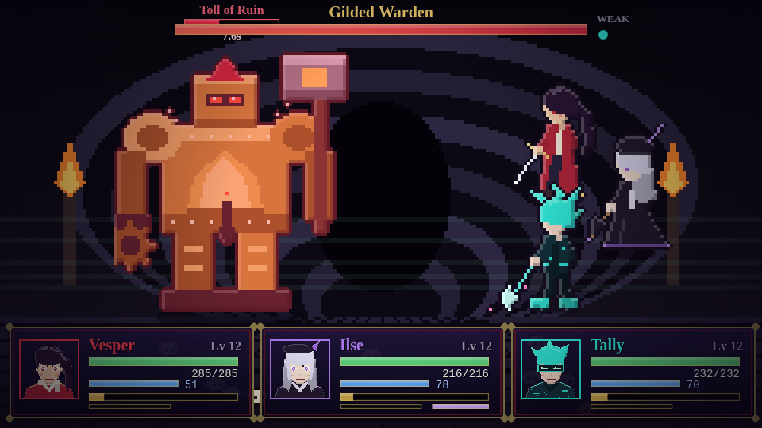
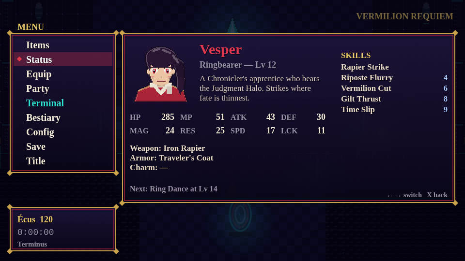

# VERMILION REQUIEM

> *Every painting is a promise that the world will stay. Someone has begun to break it.*

A JRPG in four Frames, built as a love letter to **Chrono Trigger**, **Clair Obscur: Expedition 33**, **Shadow Hearts** and **.hack**. It runs entirely in the browser, has **no dependencies and no build step**, and every sprite, tile, backdrop, note and sound effect is **generated procedurally at runtime**.



## Play it

```sh
python3 -m http.server 8000     # then open http://localhost:8000
# or just open index.html in a browser
```

Single-file build (for sharing / hosting anywhere): `node tools/build.mjs` → `dist/vermilion-requiem.html`.

| | Keyboard | Touch |
|---|---|---|
| Move | Arrows / WASD | D-pad |
| Confirm · talk · **strike** enemies | `Z` / Enter / Space | **A** |
| Cancel · **dodge** in battle | `X` / Esc | **B** |
| Menu | `C` / Tab | ☰ |
| Run | hold Shift | RUN |
| Switch ready hero in battle | `Q` / `E` | — |

Gamepad input is wired up but untested. Progress is saved to `localStorage` (Menu → Save, or at any Inkwell).

## The game

Vesper, a Chronicler's apprentice, bears the **Judgment Halo**. On the night of the Vermilion Hour a masked Curator begins *varnishing* Vesper's city: erasing people so completely that nobody remembers to mourn them. Chasing her takes the party through three eras of one long painting, and into the blank white space at the end of it.

| Frame | Place | Boss | Joins |
|---|---|---|---|
| **I — 1899** | Vesperine, Opéra, Catacombs | Echo of Cosette · Gilded Warden | Gaspard, **Ilse** |
| **II — 400 BC** | Oriel's Glade, Verdigris Wood, Temple of the Sunken Score | Chorister Marionette | (Ilse's Fusion) |
| **III — +300** | Terminus (Root Town), the Datacore | Null Regent | **Tally** |
| **IV** | Lacuna, the Unpainted Hour | The Curator (two forms) | |

A vertical slice: about an hour of play if you explore (I have not timed a human run; the bot-driven story test clears it in far less). Nine maps (five hand-built, four procedurally generated from fixed seeds), 14 enemy types, 6 boss forms, a 12-entry lore Terminal, a bestiary, three shops, gear and 30 levels.

## Ring-Time Battle

Four systems, blended so each one changes what you do:

- **Active time gauges + combo techs** *(Chrono Trigger)*. Enemies are visible on the map, so you choose your fights, and a strike (`Z`) stuns them for a first-strike advantage. Heroes act when their gauge fills; when partners' gauges are both full you can trade two or three turns for a **Dual / Triple Tech** (Crossfire Waltz, Vermilion Eclipse, Chrono Requiem…).
- **The Judgment Ring** *(Shadow Hearts)*. Every attack and spell spins a ring. Press `Z` as the needle crosses each gold arc; hit the white core for a critical. Bigger skills mean more arcs, faster needles, tighter timing. Ring hits fill each hero's **Resonance**, which unlocks their **Requiem** ultimate.
- **Telegraphed dodge & parry** *(Clair Obscur)*. Enemy attacks announce themselves with a closing ring. Press `Z` exactly as it meets the inner circle to **parry** (negate, counter, refund gauge); press `X` to **dodge**; a mistimed `Z` still *blocks* for half damage. Spiked rings are **heavy** (dodge only). **Feints** hold the ring before finishing.
- **Data Drain & charging bosses** *(.hack)*. Bosses **charge** devastating moves you can see coming: **Tally's Data Drain** and **Rootkit** interrupt them (and steal HP/MP).
- **Fusion** *(Shadow Hearts)*. Ilse's **Malice** builds as she suffers. At 100 she can **Fuse** into the Black Swan for three empowered turns.

Options (Menu → Config): **Difficulty** (Story / Normal / Hard), **Timing assist** (wider windows), **Auto Judgment Ring**, battle time (Wait / Active), text speed, volumes.





## More screenshots

| | |
|---|---|
|  |  |
|  |  |
|  |  |

## How it's built

| File | Role |
|---|---|
| `src/util.js` `src/input.js` | RNG, colour maths, tweens; keyboard/gamepad/touch → actions |
| `src/gfx.js` | Two-layer display (pixel-perfect 480×270 world + hi-res UI), the `Pix` pixel-art painter (rim-light + outline post-process), external-asset loader |
| `src/art_chars.js` | Procedural field sprites, skeleton-posed battle sprites, expressive portraits |
| `src/art_enemies.js` | 14 creatures and 6 boss forms composed from shapes |
| `src/art_world.js` | 7 tilesets, 30 props, 9 backdrops |
| `src/audio.js` | WebAudio synth (pluck/pad/organ/choir formants/bell/drums), reverb, step sequencer, 15 tracks, 30+ SFX |
| `src/data.js` | Party, skills, techs, items, gear, enemies, encounter tables, map builders, Terminal |
| `src/field.js` | Exploration, collision, lighting, roaming enemies, chests, gates |
| `src/battle.js` `battle_draw.js` `fx.js` | The battle system, its rendering and effects (with an ink-splatter paint layer) |
| `src/menu.js` `ui.js` | Menus, shop, dialogue, ornate UI kit |
| `src/story.js` | Every cutscene, NPC and boss encounter |

## Bring your own art (PixVerse, or anything)

The game ships fully playable with procedural art. To replace pieces with generated or hand-made images, drop PNGs into `assets/ai/` **using the exact filenames** listed in [`docs/ASSET_PROMPTS.md`](docs/ASSET_PROMPTS.md) (42 slots: portraits, battle sprites, enemies, backdrops, title art; each has a ready-to-paste prompt), then run:

```sh
node tools/make_manifest.mjs     # tells the game which files exist
```

Sprites (`battle_*`, `enemy_*`) can have a flat colour background: it is removed automatically. **Serve over HTTP** for that (browsers block pixel readback of local files on `file://`); or supply transparent PNGs. Missing files fall back to the procedural art, so you can replace one piece at a time.

## Testing

```sh
npm i -D playwright              # once
node tools/test/story.js         # bot plays intro → credits, teleporting between beats
node tools/test/balance.js mid   # every boss/encounter at its expected level (low|mid|high skill bots)
```

The bot presses real inputs: it plays dialogue, drives the menus, hits Judgment Rings, parries and dodges, heals, uses Fusion and interrupts charging bosses. `Main.turbo` runs the sim faster than real time.

## Credits

Original characters, story, art, music and code. Inspired by, not derived from, the games above.
